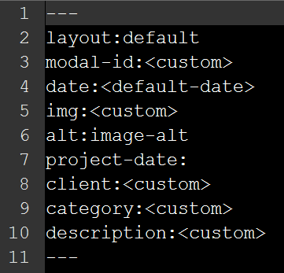
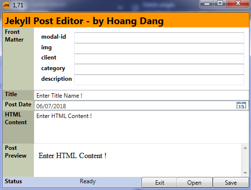
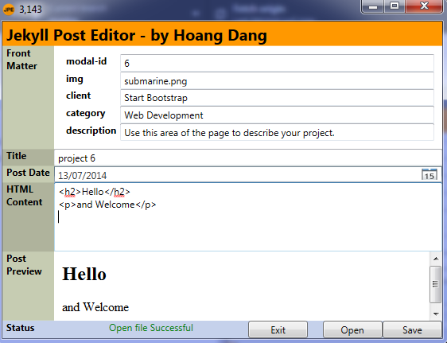
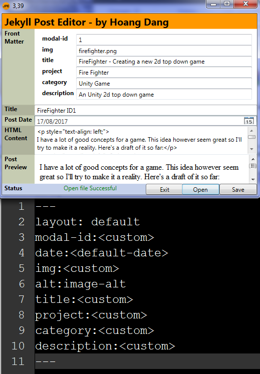

# Jekyll-Post-Editor

This is a WPF application in order to help generating posts for Jekyll websites. This program was created because I just recently discovered about github pages which uses Jekyll. I made this to help me build my own website. 

Check it out at: [dnh4.github.io](https://dnh4.github.io)

# How to use

- Change template/default.template to your Jekyll website front matter format
- Launch Jekyll-Post-Editor.exe
- I recommend using an 3rd party HTML generator to create content for the post (future update will have this in the app) 

# Here are some screenshots:

Default included front matter template



The application after launch



After load a post



You can always change the default.template



```
Note that you have to relaunch the application in order to update to new front matter template currently. Future update will have feature to eliminate this process
```